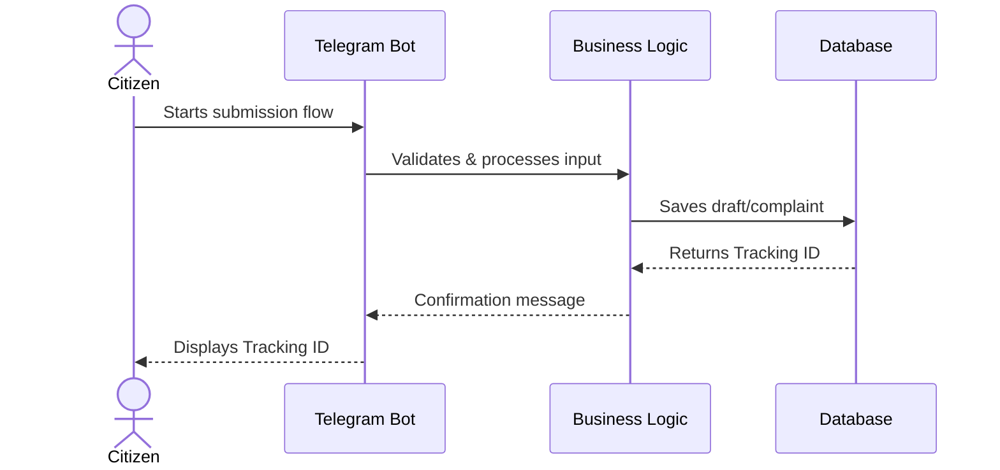
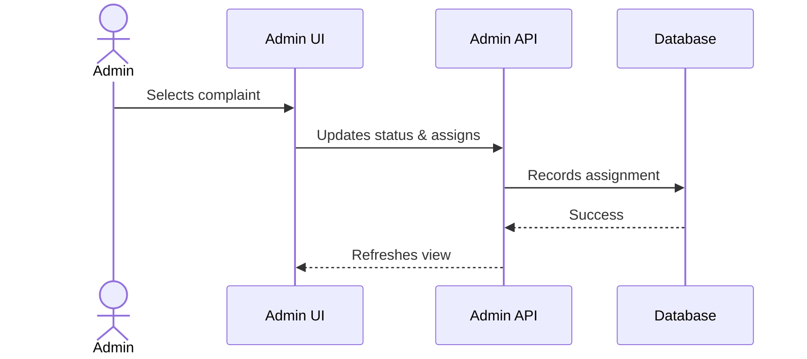
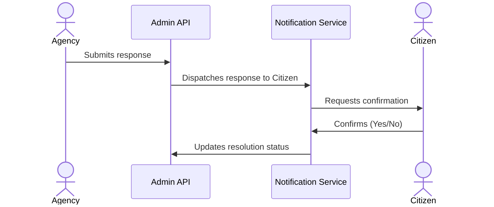
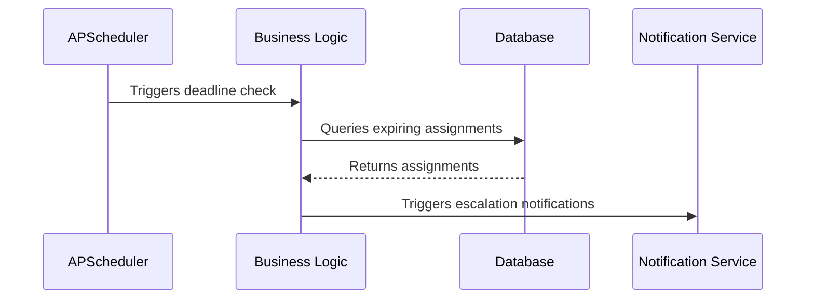

# Architecture Document

## Tech Stack Decision
- **Python 3.11 + python-telegram-bot v20 (async)**: Handles Telegram bot interactions asynchronously. Python 3.11 offers improved performance. The library natively supports the modern Telegram Bot API with async functionality.
- **FastAPI**: Used for the admin REST API and web panel. Selected for its high performance, automatic OpenAPI documentation, and native async support.
- **SQLAlchemy 2.0 (async) + Alembic**: The database layer. SQLAlchemy 2.0 provides robust async database operations. Alembic handles database migrations.
- **SQLite (Development) / PostgreSQL (Production)**: SQLite for zero-setup local development, switching to PostgreSQL for robust, scalable production deployment.
- **Pydantic v2**: Handles data validation and serialization. Integrates seamlessly with FastAPI and offers superior performance.
- **APScheduler**: Manages background jobs, such as deadline checks, notifications, and reminders.
- **Jinja2**: For rendering server-side templates in the Admin Web UI.
- **pytest + pytest-asyncio**: For comprehensive unit and integration testing.

## System Components
1. **Telegram Bot Module**: Citizen-facing interface utilizing conversation handlers to guide users through submission and tracking.
2. **Admin API Module**: FastAPI application exposing endpoints with authentication, RBAC, and CRUD operations.
3. **Admin Web UI**: Server-rendered templates via Jinja2 providing an accessible dashboard for administrators.
4. **Database Layer**: SQLAlchemy models and repository pattern implementations.
5. **Business Logic Layer**: Services encapsulating domain logic (complaint handling, assignments, notifications, deadlines, statistics).
6. **Background Job Scheduler**: Background processes executing periodic tasks (deadline checks, reminders, notification retries).
7. **Notification Service**: Centralized service for dispatching Telegram messages to citizens and staff.

## Data Flow Diagrams

### Citizen Submits Complaint Flow

### Admin Triages and Routes Flow

### Agency Responds and Citizen Confirms Flow

### Deadline Escalation Flow

## Database Schema Overview
**Tables:**
- `users`: Citizen profiles
- `consent_records`: [CONFIRM] Legal consent logs
- `complaints`, `complaint_drafts`: Submissions and drafts
- `categories`, `organizations`, `mfy_areas`: Taxonomy and geographical data
- `assignments`, `status_events`: Routing and lifecycle tracking
- `responses`, `attachments`: Agency replies and files
- `deadlines`, `deadline_extensions`: Time management
- `notifications`, `audit_events`: Message logs and system audits
- `admin_users`, `admin_roles`, `admin_sessions`: Admin auth and RBAC
- `rate_limits`, `system_config`: Security and operational settings

**Key Relationships:**
- A `complaint` belongs to a `user` and maps to one `category`.
- A `complaint` can have multiple `assignments` and `status_events`.
- `responses` are linked to specific `assignments`.

## Security Architecture
- **Auth Flow**: Admin panel uses session-based authentication with secure, HttpOnly tokens.
- **RBAC**: Enforcement of roles at both service and API layers (e.g., Admin vs. Agency Staff).
- **PII Handling**: [CONFIRM] Redaction of sensitive user data in application logs; strict access controls.
- **File Attachment Security**: Sanitization of uploaded files, virus scanning (if applicable), and secure storage paths.
- **Webhook Security**: Telegram webhook verification using secret tokens to prevent unauthorized requests.

## Deployment Considerations
- **Local Dev**: SQLite database, Telegram bot in long-polling mode, running natively or via docker-compose.
- **Production**: PostgreSQL database, Webhook mode for the bot, behind a reverse proxy (Nginx/Traefik) with TLS termination.
